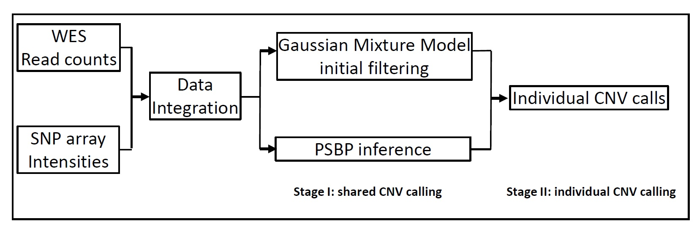

# BMI-CNV
A Bayesian framework for multiple genotyping platforms detection of copy number variation.
## Author
Xizhi Luo, Guoshuai Cai, Alexander C. Mclain, Christopher I. Amos, Bo Cai, Feifei Xiao.
## Description
Copy number variations (CNVs) are gains or losses of chromosomal segments and have been found to be associated with many complex human diseases. Whole-exome sequencing (WES) enables detection of CNVs with high resolution in functional protein-coding regions. However, variations in the intergenic or intragenic regions are excluded from these studies. Fortunately, in many exiting large cohorts, samples have been previously sequenced by different genotyping platforms, such as SNP array. As a result, methods for integrating multiple genotyping platforms are highly demanded for improved CNV detection. Moreover, conventional single sample-based CNV calling methods often suffer from high false discovery rate due to prominent data noise. A multi-sample strategy may reduce detection error and will be more robust to data variations. 

We developed BMI-CNV, a Bayesian Multi-sample and Integrative CNV (BMI-CNV) profiling method using existing WES and microarray data. By incorporating complementary information from multiple platforms, our method can detect CNVs with a genome-wide scale, while integrating concurrent information shared by multiple samples dramatically improve the detection performance of common CNVs. For the multi-sample integration, we identify the shared CNVs regions across samples using a Bayesian probit stick-breaking process model coupled with a Gaussian Mixture model estimation. 
## General workflow
Our method mainly focuses on CNV detection by integrating the SNP array and WES data, although it can also be naturally applied to the WES data only situation. Fig 1 shows an overview of the framework of BMI-CNV. First, WES read counts and SNP array intensities are integrated using a series of data integration procedures, including normalization, standardization, and merging. Our main algorithm consists of two main stages: Stage I uses a Bayesian PSBP method  coupled with a Gaussian mixture model-based initial data filtering to identify shared CNV regions, and Stage II as the individual CNV calling procedure. 



### Prerequisite
CORRseq and SARAseq
```r
install.packages("devtools")
library(devtools)
install_github("FeifeiXiaoUSC/modSaRa",subdir="package")
install_github("FeifeiXiaoUSC/CORRseq-and-SARAseq",subdir = "CORRseq")
install_github("FeifeiXiaoUSC/CORRseq-and-SARAseq",subdir = "SARAseq")
```
CODEX2 (https://github.com/yuchaojiang/CODEX2)
```r
devtools::install_github("yuchaojiang/CODEX2/package")
```
EXCAVATOR2:https://sourceforge.net/projects/excavator2tool/files/EXCAVATOR2_Package_v1.1.2.tgz/download

samtools: https://github.com/samtools/samtools/blob/develop/INSTALL

### Getting raw read count data
Using samtools (follow EXCAVATOR2's mannual), this requires linux enviroment (e.g., ubuntu OS).
```r
EXCAVATOR2> perl EXCAVATORDataPrepare.pl ExperimentalFilePrepare.w50000.txt processors 6 --target MyTarget_w50000 --assembly hg19
```
Using Rsamtools (follow CODEX2'S manual http://htmlpreview.github.io/?https://github.com/yuchaojiang/CODEX2/blob/master/demo/CODEX2.html)

Example output
```r
> Y_qc[1:5,1:5]
                  NA06994 NA07000 NA07056 NA07357 NA10847
1:2938187-2939417    1093     831     541     767    1072
1:3102653-3103043     152     356     136     291     160
1:3160585-3160735      82      63      33      90      90
1:3301632-3301902     264     227     157     181     245
1:3327905-3329375     969     962     405     655     867
```
### Normalization
The default normalization method for **CORRseq** is EXCAVATOR2 median normalization, the following procedure generate **log2R-MED** for each testing sample.
```r
EXCAVATOR2> perl EXCAVATORDataAnalysis.pl ExperimentalFileAnalysis.w50K.txt --processors 6 --target MyTarget_w50K --assembly hg19 --output /.../OutEXCAVATOR2/Results_MyProject_w50K --mode ...
```
log2R-MED (Log2R) for one sample:
```r
Chromosome	Position	Start	End	Log2R	SegMean	Class
1	20201	10202	30201	0.542625446945389	0.363527762355447	OUT
1	40201	30202	50201	0.339622160832357	0.363527762355447	OUT
1	65567	65434	65700	0.708845027878818	0.363527762355447	IN
1	65902	65756	66048	0.341973588227948	0.363527762355447	IN
1	69549	69090	70008	0.225902832162026	0.363527762355447	IN
1	80208	70209	90208	0.385081936482947	0.363527762355447	OUT
1	100208	90209	110208	-0.511761046706045	-0.642331505481395	OUT
1	120208	110209	130208	-0.389784914264831	-0.642331505481395	OUT
```
